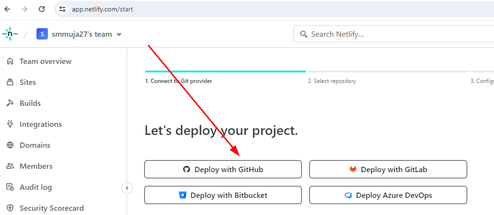

# Moo Beauty
A Company Profile Website Template
- My first company profile website template
- Free of use (educational, commercial, other purposes), please continue reading 

## Deployed here:
https://moo-beauty.smmuja.com/

## This documentation include
- About the project
    - Feature
    - Design consideration
    - Site audit
    - How to clone
- Deployment
    - Netlify Deploy
    - Custom domain
- The Author

## About the Project
### Feature
- Home/main
Where your audience can get to know if you offer the best products/services they need
- Promo/Offer Section
To demonstrate ongoing promotional campaign
- Team Section
To show credibility by showing the persons behind the scenes
- Blog/Article Section
To show expertise in your industry
- Membership section
To invite your audience to register and become a  member


### Site Audit 
- This site is audited using lighthouse to measure below benchmark
    - Performance
    Measure things such as text visibility and correct image sizing to be displayed to audience
    - Accessibility
    Correct use of html tags so that site can be easily read by both bot and human
    - Best Practices

    - SEO
    To make your website better crawlable by Search Engine and achieve better visibility
### How to Clone
You are free to use and edit the design according to your needs, and even deploy to your own hosting/server and custom domain
Here's how :
    1. Fork this project to your own directory
    2. Git clone to your local computer
    3. Edit using VS Code or any application convenient to you
    4. Push to your own repository
        Use the following commands
        `git add .` 
        `git commit -m "your-message"`
        `git push`
    5. Deploy (Elaborated more on the following section)

Link : https://moo-beaaty.smmuja.com/


## Deployment

### Netlify Deploy
This project is deployed and hosted on Netlify. Here's how
1. Create a Netlify account on https://www.netlify.com/
2. After account is created you will see the home dashboard here, go to "Add new site" section

3. We will use Github autodeploy, so let's choose Github

4. Choose the organization and repository you want to deploy

5. Here we will use the default settings, so just go on and click "Deploy"

6. Yor site is accessible via Netlify subdomain


### Custom Domain 
1. Buy your own domain via https://niagahoster.co.id/

2. Go to Netlify > Domain Management > Input your custom domain


3. Get the DNS records from Netlify


4. Go to Niagahoster > DNS Management. Delete default DNS for A record and WWW CNAME record


5. Add the DNS record from Netlify

> And it's done actually. But you can also use CloudFlare DNS Management
6. Go to CloudFlare from https://cloudflare.com/

7. Add your domain to CloudFlare


8. Get CloudFlare name server

9. Change the name server from Niagahoster DNS Management

10. Add DNS record from Netlify to Cloudflare


11. Website is acessible using your own domain


# About the Author
> Get to know me better 👋🌸
## My Bio
```
Hi, Im Muja, an aspiring Software Engineer
Having interest in digital things from product to marketing, currently learning the technical side of the industry
```
## My Technical Skills :
1. Blogger :woman_mechanic:
2. Wordpress :globe_with_meridians:
3. cPanel :penguin:

## My Links
- Website: 
    - [zayanamuja.com](https://www.zayanamuja.com) : Personal Blog
    - [deardeadliner.com](https://www.deardeadliner.com) : Passion Project
- Github: [smmuja](https://github.com/smmuja)
- LinkedIn: [Muja S.](https://www.linkedin.com/in/smmuja/)

Basically I'm into many things, let's be friends 🌸
```
